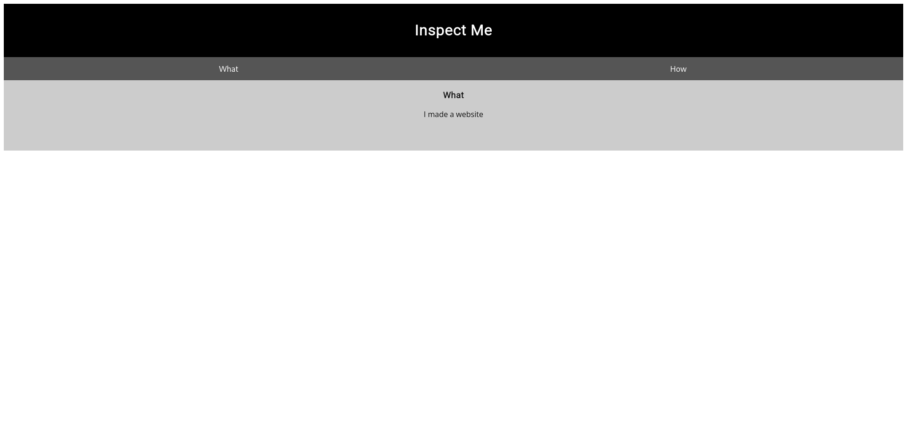
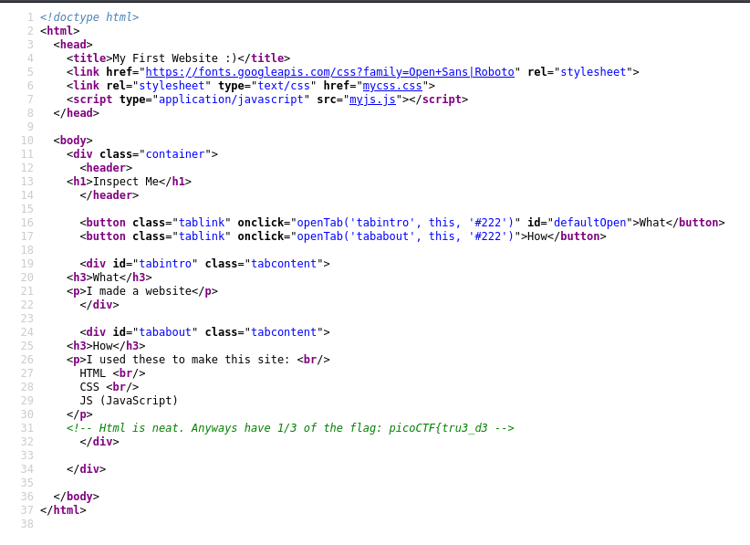
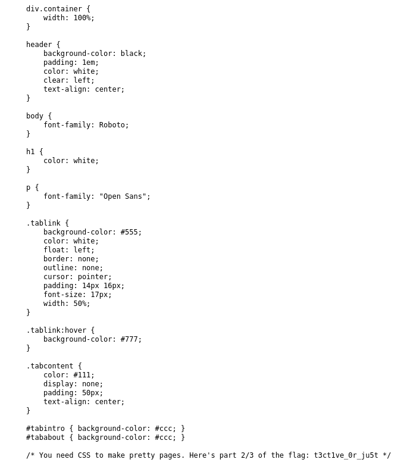
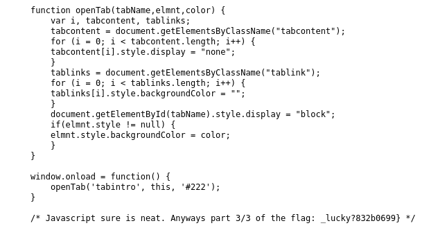

# [Challenge name]
- **Category**: Web Exploitation
- **Difficulty**: Easy
- **Author**: zaratec/danny
- **Date**: 19/04/2025

---

# 📝 Description
Kishor Balan tipped us off that the following code may need inspection: https://jupiter.challenges.picoctf.org/problem/41511 or http://jupiter.challenges.picoctf.org:41511

---

# 🛠 Solution
1. Open the challenge

	
2. View page source > Read source -> Part one of the flag `picoCTF{tru3_d3` > Switch to source of css file

	
3. View page source > Read source -> Part two of the flag `t3ct1ve_0r_ju5t` > Switch to source of javascript file

	
4. View page source > Read source -> Part three of the flag `_lucky?832b0699}`

	
---

# 🏁 Flag
> picoCTF{tru3_d3t3ct1ve_0r_ju5t_lucky?832b0699}

---

# 📄 Notes
Check source of website

---

# 📚 Resources
None
