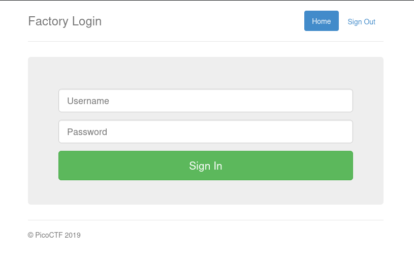
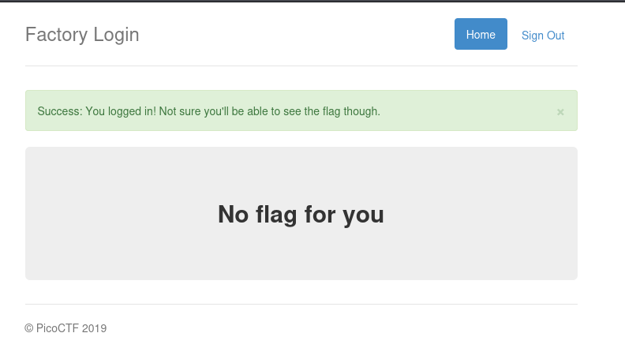
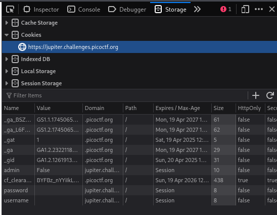
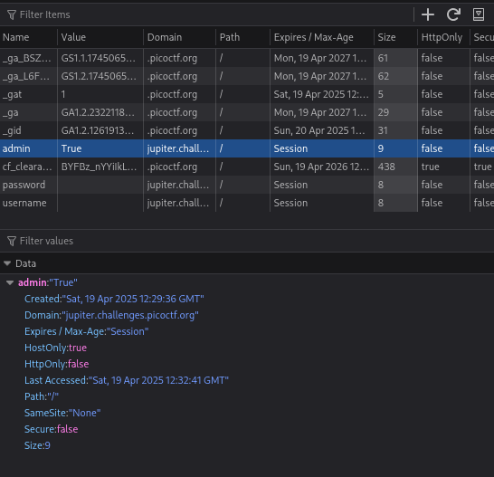
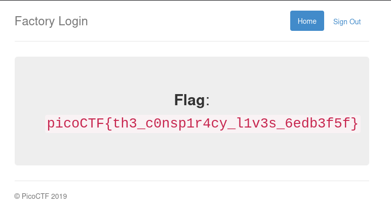

# [Challenge name]
- **Category**: Web Exploitation
- **Difficulty**: Easy
- **Author**: bobson
- **Date**: 19/04/2025

---

# 📝 Description
The factory is hiding things from all of its users. Can you login as Joe and find what they've been looking at? https://jupiter.challenges.picoctf.org/problem/15796 or http://jupiter.challenges.picoctf.org:15796

---

# 🛠 Solution
1. Open the challenge

	
2. Press sign in

	  
3. Open Dev Tools > Storage > Cookies

	
4. Change the value of the `name` variable from `false` to `true`

	
5. Reload the website

	 
---

# 🏁 Flag
> picoCTF{th3_c0nsp1r4cy_l1v3s_6edb3f5f}

---

# 📄 Notes
Check cookies if possible to login without backend

---

# 📚 Resources
None
