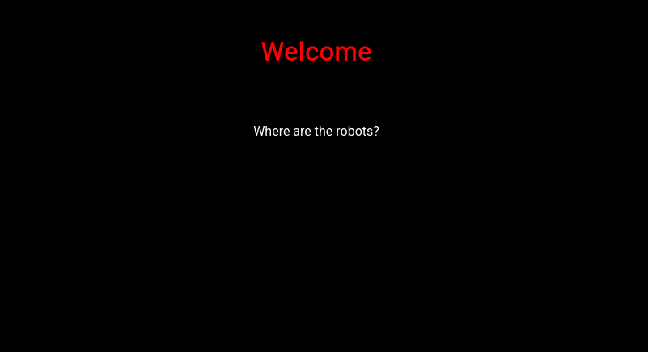
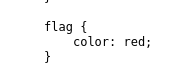
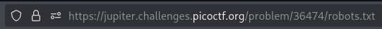
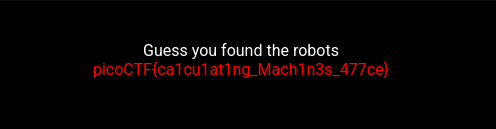

# [Challenge name]
- **Category**: Web Exploitation
- **Difficulty**: Easy
- **Author**: zaratec/Danny
- **Date**: 19/04/2025

---

# 📝 Description
Can you find the robots? https://jupiter.challenges.picoctf.org/problem/36474 or http://jupiter.challenges.picoctf.org:36474

---

# 🛠 Solution
1. Open the challenge

	
2. Check source > View source of file `style.css` > There is a color-coded `flag` tag => This css file may be used on another website. 

	 
3. Guess the robots.txt file

	
	
4. `Disallow: /477ce.html` => There is a hidden website

	
---

# 🏁 Flag
>  picoCTF{ca1cu1at1ng_Mach1n3s_477ce}

---

# 📄 Notes
- Check source
- Check file robots.txt

---

# 📚 Resources
None
